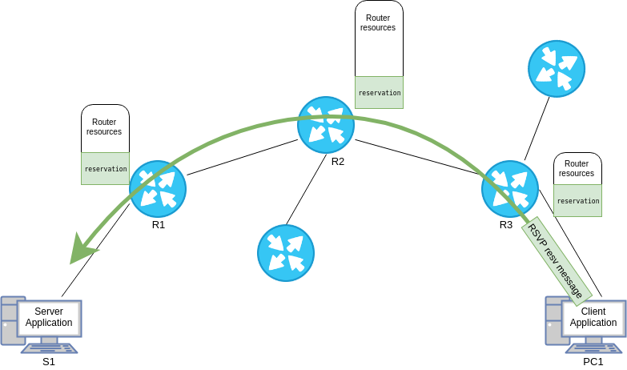

Model Integrated Services
===
Spis treści
1. [Wprowadzenie](#wprowadzenie)
2. [Usługi zintegrowane](#uslugi_zintegrowane)
3. [Usługi modelu IntServ](#uslugi_modelu_intserv)
4. [Protokół RSVP](#protokol_rsvp)
5. [Współpraca modeli IntServ i DiffServ](#wspolpraca)
6. [Źródła](#zrodla)
---
### Wprowadzenie 
Znaczny wzrost sieci Internet bezpośrednio wpływa na znaczny wzrost ruchu sieciowego. Z pojawieniem się takiego typu aplikacji
jak aplikacje internetowe, wideo w czasie rzeczywistym, telefonia IP i wiele innych, ruch sieciowy stawał się bardziej 
obciążony. Standardowe protokoły stosu TCP/IP nie oferują gwarantowanej przepustowości lub minimalnego czasu opóźnienia 
pakietów. Taki problem zmusił sieciowe organizacje do pszukiwania nowych sposobów monitorowania ruchu w sieci. Jednym z 
takich rozwiązań stała się technologia "usług zintegrowanych" (Integrated services) od grupy roboczej IETF, zdefiniowana w 
1997 w standardzie [RFC 1633](https://tools.ietf.org/html/rfc1633).

### Usługi zintegrowane 
Jest to jeden z mechanizmów, zapewniających jakość usług (ang. Quality of Service). Działa na zasadzie rezerwacji zasobów dla
przepływającego strumienia. Wsparciem tego jest mechanizm sygnalizujący w postacie protokołu RSVP (Resource ReSerVation 
Protocol), który informuje rutery na trasie datagramu o wymaganiach stawianych przez aplikacje nadające dane. Rezerwacja, 
czyli akceptacja ruterem stawianych wymóg, następuje tylko w przypadku, gdy router posiada odpowiednią ilość wymaganych 
zasobów. Po dokonaniu rezerwacji przez wszystkie węzły na trasie strumienia danych następuje zestawienie połączenia i 
przesłanie datagramów.

Architektura usług zintegrowanych zapewnia pełne rozróżnienie pakietów pochodzących z różnych sesji. Pozwala to na odrębne 
traktowanie poszczególnych strumieni i zarazem zapewnienie jakości usługi w relacji od końca do końca. Dla każdego strumienia 
można zdefiniować odmienne wartości parametrów QoS. Ponadto strumienie danych są niezależne i nie zakłócają się wzajemnie.

### Usługi modelu IntServ 
W modelu usług zintegrowanych (Intserv) zdefiniowano dwie usługi:

* **Usługa gwarantowana** (ang. guaranteed service) [RFC 2212](https://tools.ietf.org/html/rfc2212) może być stosowana do obsługi aplikacji wymagających ograniczonego czasu dostarczenia. Dla tego typu aplikacji, dane dostarczane do aplikacji po przekroczeniu predefiniowanej jednostki czasu są bezwartościowe. Dlatego też usługa gwarantowana przeznaczona jest do utrzymania określonej wartości opóźnienia w dostarczaniu pakietów end-to-end (od końca do końca) dla strumienia. Jest to osiągane dzięki sterowaniu opóźnieniami kolejkowania w elementach sieciowych wzdłuż ścieżki strumienia danych. Usługa gwarantowana nie wprowadza jednak ograniczeń w jitterze (czyli czasie pomiędzy kolejnymi przychodzącymi pakietami).

* **Usługa sterowanego obciążenia** (ang. controlled-load service) [RFC 2211](https://tools.ietf.org/html/rfc2211) może być stosowana dla aplikacji adaptacyjnych, które mogą tolerować pewne opóźnienia, ale są wrażliwe na stany przeciążenia ruchem. Tego typu aplikacje działają efektywnie wtedy, gdy sieć jest lekko obciążona, natomiast wydajność maleje drastycznie w stanie mocnego obciążenia sieci. Dlatego też controlled-load service został zaprojektowany do wprowadzenia w przybliżeniu takiej samej usługi jak usługa best-effort w lekko obciążonej sieci bez względu na aktualny stan sieci. Usługa ta jest opisywana jakościowo jako ta, gdzie brak jest określonych wartości opóźnienia i strat.

Każdy węzeł sieci zgodny z modelem IntServ powinien mieć zaimplementowane wymienione poniżej następujące mechanizmy sterowania ruchem:

* **Admission control** (sterowanie przyjmowaniem zgłoszeń) – mechanizm polegający na sprawdzaniu, czy dostępne zasoby są wystarczające do zapewnienia żądanych parametrów transmisyjnych.

* **Traffic classification** (klasyfikacja ruchu) - rozróżnianie pakietów należących do różnych strumieni.

* **Traffic policing** - sprawdzanie zgodności charakterystyki ruchowej strumienia danych z kontraktem ruchowym

* **Scheduling** (szeregowanie pakietów) - polegające na zmianie kolejności pakietów w kolejce wyjściowej, mające na celu zapewnienie strumieniom danych gwarantowanej jakości obsługi.

### Protokół RSVP 

Jak już wspomniano wcześniej, model Intserv jest oparty o protokół rezerwacji RSVP ([RFC 2205](https://tools.ietf.org/html/rfc2205), [RFC 2210](https://tools.ietf.org/html/rfc2210)), który umożliwia realizację żądania przez daną aplikację, wymagającą rezerwacji zasobów w sieci. Na Rys.1 jest pokazano jak server **(S1)** chcąc przesłać dane do komputera **(PC1)**, rezerwuje ścieżkę do przekazania danych.

*Rys.1*

W tym przypadku jest wysyłana wiadomość typu "**PATH**" (w której są zawarte wymagania do jakości strumienia) przez wszystkie routery po drodze do klienta docelowego, na co w odpowiedź klient generuje komunikat typu "**RESV**" Rys.2. 

*Rys.2*

Wiadomość RESV jest przenoszona do węzła źródłowego (wysyłającego) w kierunku przeciwnym wzdłuż ścieżki, którą przebyła wiadomość PATH. Każdy router pośredniczący wzdłuż ścieżki może odrzucić lub zaakceptować żądaną rezerwację w wiadomości RESV. Jeśli rezerwacja zostanie odrzucona, to router odrzucający wysyła wiadomość o błędzie do odbiorcy i proces sygnalizacyjny zostaje przerwany. Jeśli żądanie zostanie zaakceptowane, to pasmo łącza i odpowiednia wielkość buforu zostanie przydzielona potokowi oraz związana ze stanem potoku informacja jest instalowana w routerach.

Protokół RSVP jest jednokierunkowym, więc w przypadku połączenie dwukierunkowego (np. wideo konferencja) żądanie na rezerwacje jest wysyłane z obu hostów.

### Współpraca modeli IntServ i DiffServ 
Model usług zintegrowanych IntServ oraz model usług zróżnicowanych DiffServ są technikami wzajemnie się uzupełniającymi. Można je stosować w różnych obszarach sieci.
* Protokół sygnalizacyjny RSVP, opracowany dla modelu IntServ, pozwala zapewniać żądaną jakość obsługi pojedynczym strumieniom danych w relacji od końca do końca. Nie może on być jednak stosowany w dużych sieciach ze względu na omówione wcześniej problemy skalowalności.
* Model DiffServ, dzięki ograniczeniu liczby klas usług oraz rezygnacji z protokołu sygnalizacyjnego, nie ma problemów ze skalowalnością i dobrze nadaje się do stosowania w dużych sieciach. Nie zapewnia jednak pełnego rozróżnienia pakietów pochodzących z różnych aplikacji, uniemożliwia to pełne ilościowe zagwarantowanie parametrów transmisji dla poszczególnych strumieni ruchu.
Korzystając z najważniejszych zalet modeli IntServ i DiffServ opracowano podstawowe zasady ich współpracy. Zakłada się, że model IntServ będzie stosowany w obszarze sieci dostępowej, obsługującej stosunkowo niewielką liczbę użytkowników, a zatem umiarkowaną liczbę pojedynczych strumieni danych wymagających rezerwacji zasobów sieciowych. Z kolei model DiffServ, obsługujący ruch z agregowany, będzie stosowany w sieciach szkieletowych jako element pośredniczący w zapewnieniu jakości usług w relacji od końca do końca.
---
### Źródła 

* [RFC 1633](https://tools.ietf.org/html/rfc1633)
* [RFC 2212](https://tools.ietf.org/html/rfc2212)
* [RFC 2211](https://tools.ietf.org/html/rfc2211)
* Intserv - Usługi zintegrowane [www.tech-portal.pl](http://www.tech-portal.pl/content/view/61/45/)
* Zarządzanie w systemach i sieciach komputerowych [Dr inż. Robert Wójcik](http://robert.wojcik.staff.iiar.pwr.wroc.pl/dydaktyka/dzienne/zssk/ZSK_5.pdf)
